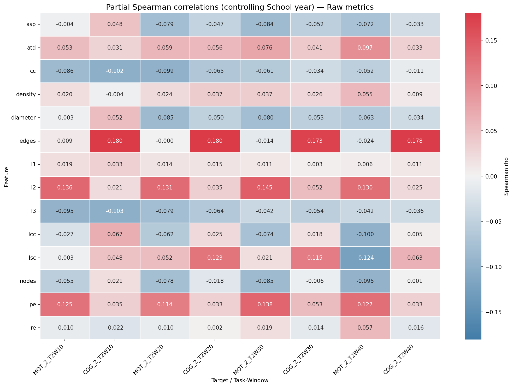
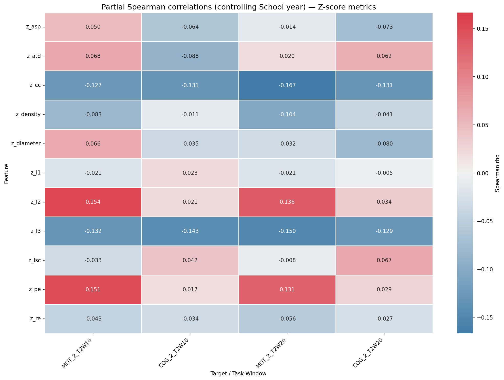
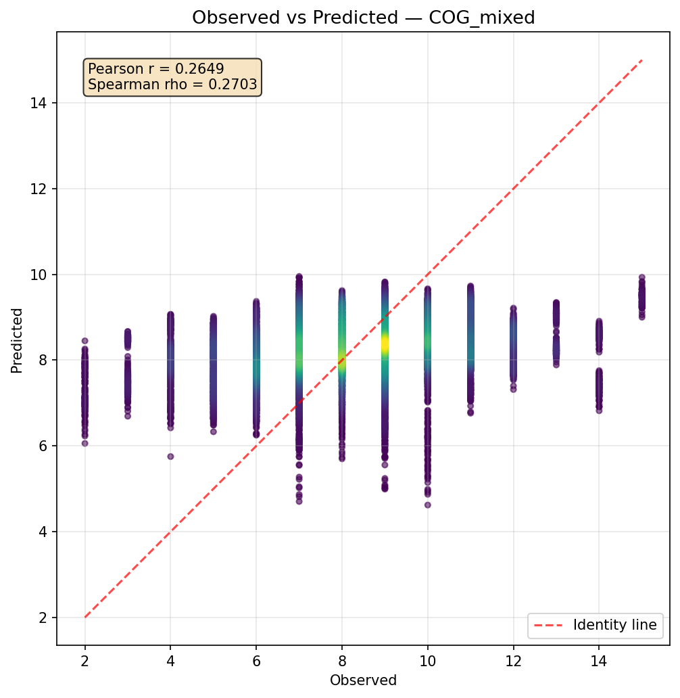
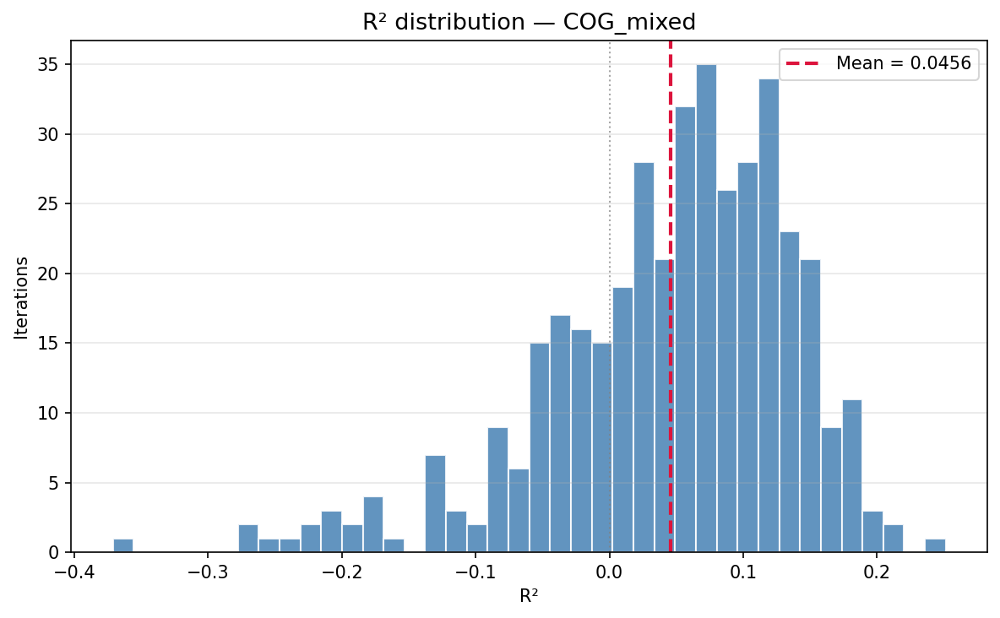
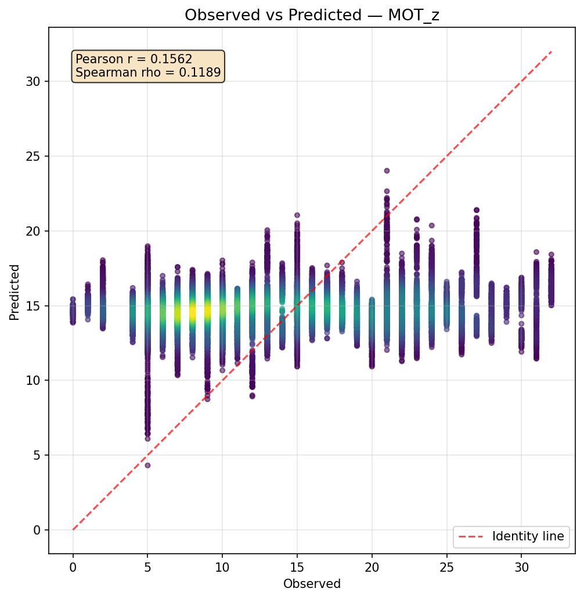
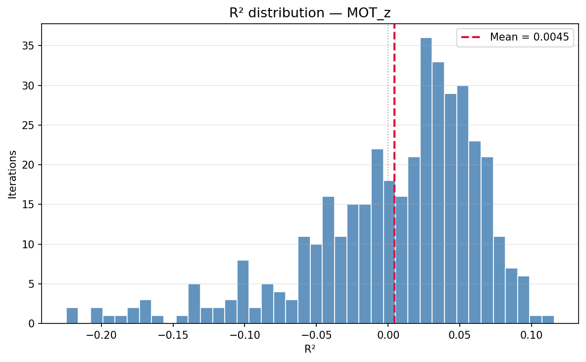
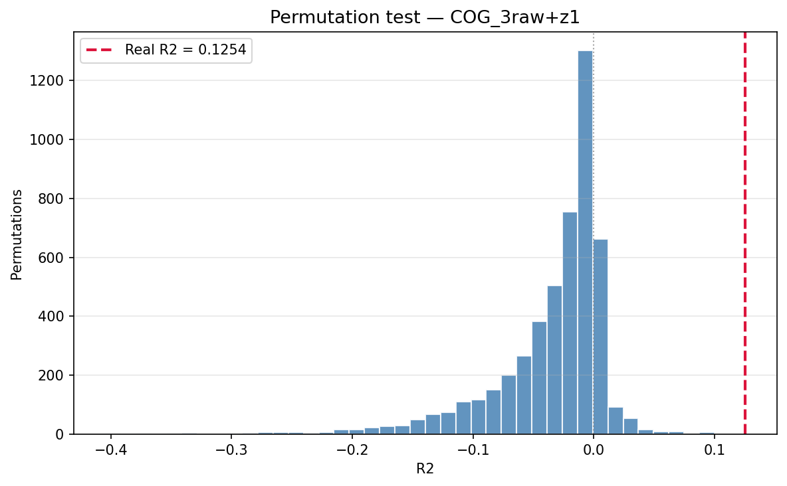
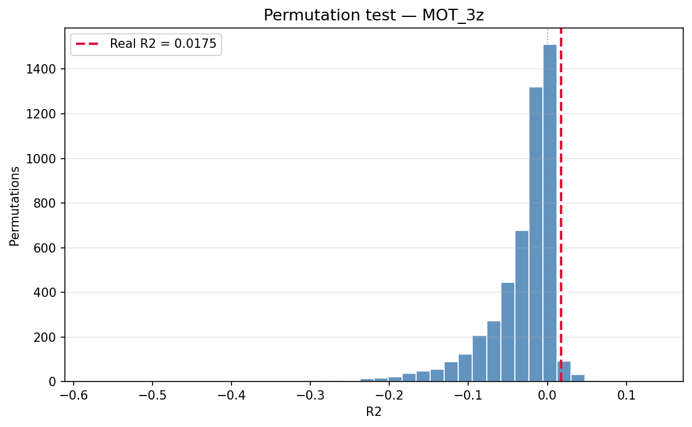

# SpeechGraph Linear Modeling Report

## Scope

This report summarizes the updated SpeechGraph outputs for correlation analysis, Monte Carlo linear regression, RidgeCV regression, and model-level permutation tests. It is an analytical report, not a usage guide.

SpeechGraph represents each participant response as a directed lexical graph. Nodes are tokens, and directed edges are within-segment transitions between consecutive tokens. Segment boundaries prevent graph edges from crossing pauses or discontinuities. The analysis evaluates whether graph topology is associated with MOT and COG.

## Available Outputs

| Activity | Metric type | Available windows | Status |
| --- | --- | --- | --- |
| Activity 2 | raw | T2W10, T2W20, T2W30, T2W40 | complete |
| Activity 2 | z-score | T2W10, T2W20, T2W30, T2W40 | available |
| Activity 6 | raw | T6W30, T6W40, T6W50, T6W150, T6W200 | complete |
| Activity 6 | z-score | not found | not available |
| Activity 7 | raw | T7W20, T7W30, T7W40, T7W50 | complete |
| Activity 7 | z-score | T7W20 | limited to W20 |

The updated outputs change the normalized-metric status. Activity 2 z-score correlations are available for W10, W20, W30, and W40. Activity 7 z-score correlations are available only for W20. Activity 6 z-score correlations are still absent, so conclusions about normalized structure in reflective or counterfactual Activity 6 speech remain incomplete.

## Analytical Definitions

Raw graph metrics describe the observed lexical graph directly. Z-score metrics compare each observed graph metric with a within-segment permutation baseline:

$$
z_m = \frac{m_\mathrm{obs} - \mu(m_\mathrm{perm})}{\sigma(m_\mathrm{perm})}
$$

The linear models estimate:

$$
\hat{y} = \beta_0 + \sum_j \beta_j x_j
$$

RidgeCV uses the ridge objective:

$$
\sum_i (y_i - \hat{y}_i)^2 + \alpha \sum_j \beta_j^2
$$

Simple Spearman correlations describe unadjusted monotonic associations. Partial Spearman correlations estimate the feature-target association after adjusting separately for School year, Age, or Educational level. The interpretation prioritizes effects that keep the same sign across simple and partial analyses and remain coherent across related windows or metrics.

## Main Findings

COG is the target with the strongest evidence. The current results favor a reduced, multi-activity model that combines raw transition volume from Activity 2, raw three-node cyclicity from Activity 6, and raw transition volume from Activity 7. In this model family, `edges_T2W10` and `edges_T7W50` contribute positive signal, consistent with a greater number of effective lexical transitions or stronger discourse continuity. `l3_T6W30` contributes negative signal, meaning that higher COG is associated with fewer raw three-node cycles in Activity 6 responses.

MOT has weaker predictive evidence. Its raw associations are positive but heterogeneous, especially around Activity 7 connectivity and clustering. The most coherent MOT pattern appears in Activity 2 z-scores: `z_l2` and `z_pe` are positive, while `z_cc` and `z_l3` are negative. This suggests higher reciprocal recurrence than expected under permutation, but lower local clustering or three-node closure relative to the permutation baseline.

The models contain non-random signal, but predictive power is low. The best COG model is stronger than the best MOT model, yet its predictions remain compressed around the mean. MOT has a statistically detectable z-score model, but its mean $R^2$ is close to zero.

## Correlation Evidence for COG

| Activity | Window | Feature | n | Simple rho (p) | Partial rho (p) | Adjustment | Interpretation |
| --- | --- | --- | --- | --- | --- | --- | --- |
| Activity 2 | T2W10 | edges | 240 | 0.202 (0.002) | 0.180 (0.005) | School year | Transition volume is positively associated with COG. |
| Activity 2 | T2W20 | edges | 237 | 0.200 (0.002) | 0.180 (0.005) | School year | The same positive transition pattern is replicated at W20. |
| Activity 6 | T6W30 | l3 | 252 | -0.208 (0.0009) | -0.157 (0.013) | School year | Three-node cyclicity is negatively associated with COG. |
| Activity 6 | T6W50 | l3 | 252 | -0.208 (0.0009) | -0.151 (0.017) | School year | The negative Activity 6 cyclicity pattern persists across windows. |
| Activity 7 | T7W50 | edges | 243 | 0.142 (0.027) | 0.164 (0.010) | School year | Activity 7 transitions add a weaker positive multi-activity signal. |
| Activity 2 | T2W10 | z_l3 | 240 | -0.117 (0.071) | -0.143 (0.027) | School year | Normalized cyclicity is mainly supported after adjustment. |
| Activity 2 | T2W20 | z_cc | 237 | -0.103 (0.114) | -0.131 (0.044) | School year | Normalized clustering is weak but directionally negative. |

The raw COG pattern is the most coherent correlation result. Activity 2 `edges` is positive across raw windows, with simple $\rho$ around 0.19–0.20. Activity 6 `l3` is negative across raw windows, with the strongest unadjusted correlations near $\rho=-0.21$. Activity 7 `edges` is weaker but useful as a positive multi-activity feature in the best regression models.

The z-score COG evidence is secondary. Activity 2 `z_l3` and `z_cc` show negative partial associations after School year adjustment, but the simple correlations are weak or marginal. Activity 7 z-scores do not show convincing COG evidence in the available W20 output.

  <figure>
    <figcaption><b>Figure 1.</b> Partial Spearman correlations (controlling for School year) between raw graph metrics and BIS-15 dimensions across Activity 2 windows. Warmer colours indicate positive associations with COG; cooler colours indicate negative associations.</figcaption>
    
  </figure>

## Correlation Evidence for MOT

| Activity | Window | Feature | n | Simple rho (p) | Partial rho (p) | Adjustment | Interpretation |
| --- | --- | --- | --- | --- | --- | --- | --- |
| Activity 7 | T7W30 | lsc | 250 | 0.174 (0.006) | 0.173 (0.006) | School year | A larger strongly connected span is associated with higher MOT. |
| Activity 7 | T7W40 | cc | 248 | 0.145 (0.022) | 0.151 (0.018) | School year | Raw local clustering in Activity 7 is positively associated with MOT. |
| Activity 2 | T2W30 | l2 | 230 | 0.138 (0.037) | 0.145 (0.028) | School year | Two-node cycles provide a smaller positive raw signal. |
| Activity 2 | T2W20 | z_cc | 237 | -0.163 (0.012) | -0.167 (0.010) | School year | Higher-than-baseline clustering is associated with lower MOT. |
| Activity 2 | T2W10 | z_l2 | 240 | 0.154 (0.017) | 0.154 (0.017) | School year | Higher-than-baseline two-node reciprocal cycles are positive. |
| Activity 2 | T2W10 | z_pe | 240 | 0.150 (0.020) | 0.151 (0.020) | School year | Higher-than-baseline reciprocal recurrence is positive. |
| Activity 2 | T2W20 | z_l3 | 237 | -0.146 (0.024) | -0.150 (0.021) | School year | Higher-than-baseline three-node cycles are negative. |

MOT raw correlations are weaker than the COG raw pattern, but they point to Activity 7 connectivity and clustering. `lsc_T7W30`, `cc_T7W40`, and Activity 7 `edges` are positive, suggesting that MOT may increase with stronger local connectedness and larger strongly connected speech components.

The MOT z-score pattern is more coherent. Positive `z_l2` and `z_pe` indicate more reciprocal recurrence than expected from segment-preserving permutations. Negative `z_cc` and `z_l3` indicate less local clustering and fewer three-node cycles relative to the same baseline. Activity 7 z-score outputs are weak and non-significant; the strongest normalized MOT evidence remains Activity 2.

  <figure>
    <figcaption><b>Figure 2.</b> Partial Spearman correlations (controlling for School year) between z-scored graph metrics and BIS-15 dimensions across Activity 2 windows. The MOT z-score pattern (z_cc negative, z_l2 and z_pe positive) is visible in the left panel.</figcaption>
    
  </figure>

## Linear Regression and RidgeCV Results

| Target | Model specification | n | Predictors | Feature set | Mean R² ± SD | Mean RMSE | Mean Spearman rho ± SD | R² < 0 | Interpretation |
| --- | --- | --- | --- | --- | --- | --- | --- | --- | --- |
| COG | OLS, raw 2-feature; covariates: none | 240 | 2 | edges_T2W10, l3_T6W30 | 0.018 ± 0.075 | 2.157 | 0.248 ± 0.124 | 33.2% | Compact raw baseline. |
| COG | OLS, raw 3-feature; covariates: none | 232 | 3 | edges_T2W10, l3_T6W30, edges_T7W50 | 0.004 ± 0.095 | 2.149 | 0.271 ± 0.119 | 38.2% | Higher rank association, weaker mean $R^2$. |
| COG | RidgeCV, raw + School year; covariates: School year | 232 | 4 | edges_T2W10, l3_T6W30, edges_T7W50, School year | 0.027 ± 0.080 | 2.124 | 0.268 ± 0.116 | 33.0% | Best purely raw covariate model. |
| COG | RidgeCV, mixed + School year; covariates: School year | 232 | 5 | edges_T2W10, l3_T6W30, edges_T7W50, z_l3_T2W10, School year | 0.046 ± 0.093 | 2.102 | 0.292 ± 0.121 | 26.8% | Best overall COG model. |
| COG | RidgeCV, raw top-10; covariates: none | 222 | 10 | edges_T2W20, edges_T2W10, edges_T2W40, edges_T2W30, lsc_T2W20, lsc_T2W30, l3_T2W10, cc_T2W10, lcc_T2W10, cc_T2W20 | -0.033 ± 0.053 | 2.227 | 0.103 ± 0.144 | 70.2% | More features degrade performance. |
| MOT | OLS, z-score 2-feature; covariates: none | 237 | 2 | z_cc_T2W20, z_l2_T2W10 | 0.002 ± 0.071 | 7.621 | 0.159 ± 0.125 | 40.2% | Small positive OLS $R^2$. |
| MOT | RidgeCV, z-score 3-feature; covariates: none | 237 | 3 | z_cc_T2W20, z_l2_T2W10, z_pe_T2W10 | 0.004 ± 0.061 | 7.614 | 0.154 ± 0.124 | 37.8% | Best MOT model by mean $R^2$ and permutation evidence. |
| MOT | RidgeCV, raw 2-feature; covariates: none | 236 | 2 | lsc_T7W30, cc_T7W40 | -0.006 ± 0.069 | 7.728 | 0.217 ± 0.117 | 43.0% | Better rank signal but negative mean $R^2$. |
| MOT | RidgeCV, raw top-10; covariates: none | 243 | 10 | lsc_T7W30, cc_T7W40, cc_T7W30, cc_T7W50, edges_T7W50, edges_T7W40, edges_T7W30, edges_T7W20, cc_T7W20, diameter_T7W30 | -0.043 ± 0.060 | 7.790 | 0.138 ± 0.113 | 74.8% | Expanded raw model performs poorly. |

The best COG model is the mixed RidgeCV specification with `edges_T2W10`, `l3_T6W30`, `edges_T7W50`, `z_l3_T2W10`, and School year. It has the highest mean $R^2$ and strongest mean Spearman association among the inspected Monte Carlo summaries. The purely raw COG model with School year is weaker but directionally consistent, which indicates that the core COG signal is mainly raw and multi-activity.

COG z-only models perform poorly, and the COG top-10 raw Ridge model also degrades performance. This pattern is consistent with redundancy among correlated windows and overfitting when many related graph features are included.

For MOT, the best RidgeCV model by mean $R^2$ is the compact three-feature z-score model with `z_cc_T2W20`, `z_l2_T2W10`, and `z_pe_T2W10`. The raw MOT model with `lsc_T7W30` and `cc_T7W40` has higher mean Spearman rho but negative mean $R^2$, suggesting some rank-order signal without well-calibrated prediction. Larger MOT feature sets perform worse.

  <figure>
    <figcaption><b>Figure 3.</b> Best COG RidgeCV model: `edges_T2W10 + l3_T6W30 + edges_T7W50 + z_l3_T2W10 + School year`. Observed versus predicted scores (left) and distribution of $R^2$ across 400 Monte Carlo splits (right).</figcaption>
    

      
      
    

  </figure>

  <figure>
    <figcaption><b>Figure 4.</b> Best MOT RidgeCV model: `z_cc_T2W20 + z_l2_T2W10 + z_pe_T2W10`. Observed versus predicted scores (left) and distribution of $R^2$ across 400 Monte Carlo splits (right).</figcaption>
    

      
      
    

  </figure>

## Coefficient Direction in Key RidgeCV Models

| Model | Feature | Mean coefficient ± SD |
| --- | --- | --- |
| COG mixed RidgeCV | z_l3_T2W10 | -0.961 ± 0.286 |
| COG mixed RidgeCV | edges_T7W50 | 0.872 ± 0.336 |
| COG mixed RidgeCV | edges_T2W10 | 0.636 ± 0.310 |
| COG mixed RidgeCV | l3_T6W30 | -0.480 ± 0.100 |
| COG mixed RidgeCV | School year | 0.173 ± 0.032 |
| MOT z-score RidgeCV | z_pe_T2W10 | 2.516 ± 1.139 |
| MOT z-score RidgeCV | z_cc_T2W20 | -2.164 ± 0.539 |
| MOT z-score RidgeCV | z_l2_T2W10 | 1.295 ± 1.060 |
| MOT raw RidgeCV | cc_T7W40 | 35.710 ± 9.577 |
| MOT raw RidgeCV | lsc_T7W30 | 0.733 ± 0.189 |

The COG coefficient signs match the correlation evidence: Activity 2 and Activity 7 transition counts are positive, Activity 6 three-node cycles are negative, Activity 2 normalized three-node cyclicity is negative, and School year is positive. The MOT z-score coefficients also match the expected pattern: `z_pe_T2W10` and `z_l2_T2W10` are positive, while `z_cc_T2W20` is negative.

Because RidgeCV is fit directly on the available predictor scales, coefficient magnitudes are scale-dependent. They should be interpreted for direction and model consistency, not as standardized effect sizes.

## Prediction Compression

| Model | Observed range | Observed SD | Predicted range | Predicted SD |
| --- | --- | --- | --- | --- |
| COG mixed RidgeCV | 2–15 | 2.190 | 4.62–9.95 | 0.675 |
| MOT z-score RidgeCV | 0–32 | 7.723 | 4.31–24.02 | 1.459 |
| MOT raw RidgeCV | 0–32 | 7.802 | 4.80–21.19 | 1.606 |

The observed-versus-predicted figures pool predictions across Monte Carlo splits. The same participant can therefore appear multiple times, so plotted points are not independent observations. The diagnostic pattern is prediction compression: predicted values occupy a much narrower range than observed scores, especially for MOT.

## Permutation Tests

| Model | Target | n | Features | Covariates | Permutations | Real R² | Null mean ± SD | Null 95% interval | Empirical p | Significant | Interpretation |
| --- | --- | --- | --- | --- | --- | --- | --- | --- | --- | --- | --- |
| COG mixed RidgeCV | COG | 232 | edges_T2W10, l3_T6W30, edges_T7W50, z_l3_T2W10 | School year | 5000 | 0.125 | -0.035 ± 0.050 | [-0.171, 0.019] | 0.0002 | yes | Validates the complete model, not graph-only increment above School year. |
| MOT z-score RidgeCV | MOT | 237 | z_cc_T2W20, z_l2_T2W10, z_pe_T2W10 | none | 5000 | 0.018 | -0.032 ± 0.047 | [-0.163, 0.013] | 0.020 | yes | The output label says raw, but the listed predictors are z-score metrics. |

The COG permutation test supports a non-random full-model signal. Because School year is included, this test validates the complete model specification rather than the incremental graph-feature contribution above School year alone.

The MOT permutation test also reaches significance, but the effect size is small. It supports non-random structure in the compact Activity 2 z-score model while still indicating limited predictive strength.

  <figure>
    <figcaption><b>Figure 5.</b> Permutation null distributions. Left: COG mixed RidgeCV model (real $R^2 = 0.125$, $p = 0.0002$). Right: MOT z-score RidgeCV model (real $R^2 = 0.018$, $p = 0.020$). The red vertical line marks the observed $R^2$.</figcaption>
    

      
      
    

  </figure>

## Methodological Interpretation

The regression results are exploratory because feature sets were selected from full-dataset correlation patterns and heatmaps rather than through selection nested inside each Monte Carlo split. The reported out-of-sample metrics evaluate the selected models, not a fully unbiased end-to-end model-selection procedure.

RidgeCV is applied directly to the predictor matrix. Since predictors are not standardized inside the estimator workflow, ridge penalties and coefficient magnitudes depend on raw predictor scale, especially in models that mix raw metrics, z-scores, and covariates.

Some graph metrics are invariant or nearly invariant under within-segment permutation. `wc`, `nodes`, and `edges` are especially likely to be uninformative as z-scores because segment-preserving token shuffles often preserve token inventory and the number of within-segment transitions.

The correlation analysis screens many tasks, windows, features, metric types, and adjustment variables. Individual p-values should therefore be interpreted as exploratory unless supported by model-level tests, directional consistency, and conceptual coherence.

## Final Interpretation

COG is the most robust target in the current SpeechGraph outputs. Its strongest evidence comes from a reduced multi-activity model: Activity 2 and Activity 7 transition counts contribute positive signal, while Activity 6 three-node cycles contribute negative signal. The best model is statistically non-random under permutation testing, although its predictive power remains modest.

MOT has weaker and less stable raw evidence, but the Activity 2 z-score profile is conceptually coherent. Higher MOT is associated with more reciprocal recurrence relative to permutation baselines and less local clustering or three-node cyclic closure. The compact MOT z-score model is significant under permutation testing, but its small $R^2$ and compressed predictions require cautious interpretation.

The current results support reduced, target-specific models rather than broad top-k feature sets. The main unresolved empirical gap is the incomplete normalized analysis: Activity 6 z-scores are absent, and Activity 7 z-scores are limited to W20.
